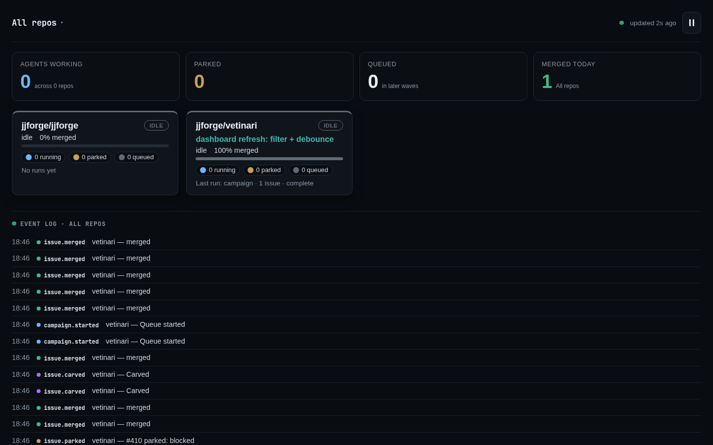
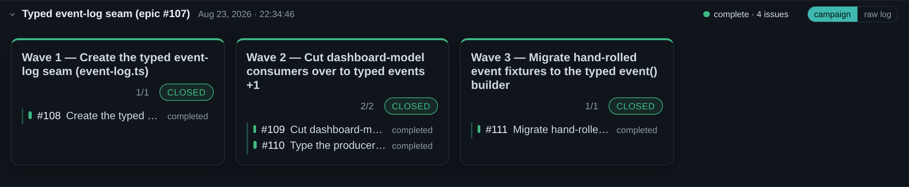

# vetinari

> **vetinari** /ˌvɛtɪˈnɑːri/ *n.*: a parallel TDD agent orchestrator in which the
> agents do all the work but never get a vote on whether it is *done*. That vote
> belongs to the test gate.
>
> *"Ankh-Morpork had dallied with many forms of government and had ended up with
> that form of democracy known as One Man, One Vote. The Patrician was the Man; he
> had the Vote."*
> Terry Pratchett, *Mort*

---

Nobody wants to babysit a coding agent. What they want even less is one that quietly
marks its own broken work as done and looks rather pleased about it. Vetinari offers
the deal you actually wanted: hand over the backlog, walk away, and come back to a
green branch or a straight question, with nothing in between and no cheerful fictions.
Your issues run as parallel agents, each sealed in its own container and branch, under
an orchestrator that keeps the one verdict that matters (is it done?) firmly to itself.
The agents do the work. They do not get to grade it.



**Green means your test command passed.** After every "I'm done" signal, the
orchestrator runs the gates from your config inside the sandbox and reads the
exit code; only zero returns green. A red gate resumes that same agent session
with the failure output attached, so the agent keeps its context and fixes the
actual failure instead of starting over. An agent announcing that it has finished
carries exactly the authority you would grant a cat announcing that it is hungry:
noted, and checked independently. This is not paranoia. Agents will declare
victory over a red suite, and do.

**A blocked agent parks: question to you, slot back to the pool.** On a
`BLOCKED` signal, an exhausted turn budget, or an idle stall, the question and
the session id are written to disk, the container is torn down, and you get a
Telegram message. Reply to it and that agent resumes with full context: new
container, fresh process, days later if you like. Parking frees the slot
immediately rather than holding a container open, so one stuck task waits quietly
in a drawer instead of taking the other nine down with it.

**Parallelism is the default, not a mode.** One branch, worktree, and container
per task isolates repository and process state, so concurrent tasks cannot trample
one another's worktrees or build outputs. (What containers isolate they do not
abolish: shared caches, external services, and your account's rate limits are
still shared, which is what the operating rules below are for.) A bounded pool
keeps N slots full, and a park hands its slot straight to whatever is next in line.

## Quickstart

```bash
npm install github:jjforge/vetinari
```

Needs Docker, Node 22+, and `.vetinari.local/.env` holding `CLAUDE_CODE_OAUTH_TOKEN`
from `claude setup-token`: your Claude Code subscription, which is what these
agents run on. The container runs the official `claude` CLI, which reads that
token exactly as Claude Code GitHub Actions does. Vetinari does not mint or
exchange credentials; it passes the token you supply straight through to that CLI
inside the agent container.

`ANTHROPIC_API_KEY` works as a drop-in alternative, and is worth switching to
when billing is the constraint rather than convenience: it gives per-run cost
attribution and spend limits in the Console, and it doesn't consume the
subscription rate windows that a parallel queue can exhaust. Neither choice
changes how the loop behaves.

Run `npx vetinari init` to scaffold the layout: a committed
`vetinari/config.mts` (below) plus a `vetinari/Dockerfile`, and the excluded
`.vetinari.local/` for machine-local state (logs, parked tasks, and the `.env`
above), added to `.gitignore`. Put everything project-specific in
`vetinari/config.mts`, nothing else needs editing:

```ts
import { execFileSync } from "node:child_process";
import { defineConfig } from "vetinari";

export default defineConfig({
  project: "myapp",
  image: "vetinari-myapp",          // templates/Dockerfile + your toolchain
  baseBranch: "main",

  // What decides green. `when` scopes a gate to branches that touched matching
  // files: explicit and logged, never a silent skip.
  gates: [
    { cmd: "npm test" },
    { cmd: "npm run test:e2e", when: /^(src\/routes|e2e)\// },
  ],

  setup: ["npm ci"],                   // once per sandbox, before the agent starts
  fetchTask: (id) => execFileSync("gh", ["issue", "view", id, "--json", "title,body,comments"], { encoding: "utf8" }),
});
```

Build the image, then prove it before spending anything on an agent: `build`
does both, reading the image name and Dockerfile from your config and layout so
neither is repeated on the CLI:

```bash
npx vetinari build             # build cfg.image from vetinari/Dockerfile, then baseline
npx vetinari build --no-baseline   # build only, skip the probe
```

`build` shells sandcastle's `docker build-image` and, on success, runs
`baseline` (below); a build failure exits non-zero with sandcastle's output
visible and skips the probe, and a red baseline exits non-zero too. It uses the
same `cfg.image` the run/queue/campaign modes use, so "build" and "run" can
never disagree on the image.

`baseline` on its own proves an already-built image: toolchain probe + every
gate, no agent:

```bash
npx vetinari baseline          # toolchain probe + every gate, no agent
```

A failing `baseline` is the cheapest failure you will ever buy: it costs no agent
and takes no prisoners. A passing baseline establishes a clean starting point:
later failures are not inherited from an already-broken image or gate
configuration (they can still arrive on their own, by way of a flaky test or a
network fault, but you will know they are new).

## Run

```bash
npx vetinari run 436                    # one task: loop until green or parked
npx vetinari queue 436 611 623 640      # fair-share pool, bounded by MAX_CONCURRENT_CONTAINERS + containerShare
npx vetinari parked                     # what's waiting on you, and why
npx vetinari status                     # all-repos landing dashboard at http://127.0.0.1:8765 (live)
npx vetinari answer 436 "use approach B, and say why in the commit"
```

Commits land on `agent/<task>`. Merging stays yours, or hand the whole
merge→test→next-queue chain to `campaign`:

```bash
git checkout main                                     # the merges land on the checked-out base
npx vetinari campaign "436 611 623" "640 655"   # each quoted arg is one batch
```

`campaign` drains a batch, merges **only its green** branches into the base with
`--no-ff`, runs the full gate on the *merged* base (the each-green-but-together-red
case a per-task gate can't catch), then deletes those branches, prunes their
worktrees, and starts the next batch on the now-advanced base. **Integration is
non-atomic** (ADR 0013): the two ways a wave can fail get two different responses,
by whether blame is attributable. A **merge conflict** is attributable to one
branch, so that one issue is **quarantined** — its branch, worktree, and session
preserved so it is resumable, never re-run from scratch — while every green that
already merged this wave stays merged and the wave carries on integrating the rest.
A **red merged base** has no single culprit (each branch was green on its own), so
the wave **wave-parks**: everything stays merged, the base sits red (never pushed,
nothing builds on it while paused), an attention notification fires, and the
campaign pauses for a human to fix forward and `campaign --resume`, or carve a
suspect and resume. When a batch finishes, any parked records for non-green tasks
in that completed wave are cleared from `.vetinari.local/parked/` so stale
questions do not bleed into the next wave's dashboard. Pushing stays yours.

On clean completion, a `campaign` or `queue` **archives the run** so a finished
run stops lingering in the dashboard and status line: the orchestrator log is
moved aside to `.vetinari.local/logs/archive/orchestrator-<ts>.jsonl` (kept, never
deleted) and replaced with an empty one, so the status reads idle. It only fires
on a clean finish with nothing still parked; a halt or an open question leaves
the state in place to inspect. Run `vetinari clear` to force the same reset
yourself. Archived runs stay browsable: each project's past runs (newest-first,
with a one-line summary) sit under its live run, and clicking one renders its
wave/issue view read-only.

`status` opens **one landing over every registered project on the host**: no
per-project server, no dropdown to find the right one. The page leads with four
counters and a card per repo (its wave and per-status counts), a cross-repo
**activity feed** flattening every project's live events newest-first underneath,
and it **updates live** over Server-Sent Events as runs advance, no reload.
Tapping an issue opens a **detail sheet** (status, turns, elapsed, the full turn
log) from which you can **carve** it out of the running campaign; the layout
reflows for a phone, so it is the same view you reach from the Telegram message
on your way past. It reads the host registry, so no gateway daemon is required.



**Carve one issue out of a campaign.** When an issue turns out not to be ready,
`carve` drops it *and everything that can't proceed without it* (the transitive
closure of its dependents), then runs the rest:

```bash
npx vetinari carve 640 "611 640" "623 701"   # 701 is blocked by 640
# carve #640 → removed #640, #701 (dependents: #701)
# remaining campaign: "611" "623"   ← runs this
```

Dependents come from your tracker via the config's `blockedBy` resolver;
`githubBlockedBy("owner/repo")` ships as a ready implementation over GitHub's
native "blocked by" links. Removal is transitive across every branch and
diamond (an issue falls if *any* of its blockers falls), and is computed over
the campaign's own issues: a blocker outside the named campaign is out of
scope. It runs the reduced campaign immediately; `--dry-run` only prints the
plan. Because carve only *drops* issues, each remaining wave stays as
conflict-free as you built it.

That form launches a **fresh reduced campaign** from a plan you supply. There is
also a **running-campaign** form, `carve <issue>` with no batch args — the same
one the dashboard's detail sheet and the gateway's `carve <issue>` reply use — that
prunes the campaign already in flight: it appends a carve event the loop honors at
the **next wave boundary**, so the in-flight wave finishes and only future waves
shrink. Carve **preserves banked work**: of the removed closure, anything already
merged or green is kept, only parked/not-yet-started issues leave the plan, and a
carved issue's parked record (branch, worktree, session) is kept by default so it
stays resumable — `--purge` is the rare true-drop that clears it.

**Graft — add issues to a running campaign.** `graft <ids…>` is the additive
mirror of `carve` (ADR 0014). Where carve prunes the unfinished remainder, graft
**extends** it: it appends a graft event the loop honors at the **next wave
boundary**, so the in-flight wave finishes untouched and the added issues re-layer
into **future** waves — after their in-campaign blockers, kept basename-disjoint,
and leaving the already-planned waves stable (a stable-insert, not a re-optimize).
Unlike carve's running-only in-place form, graft is allowed against any campaign
that has not finished — live, or paused/wave-parked/resumable and honored on the
next `campaign --resume`. It takes explicit ids only, validates all-or-nothing
(an unknown/closed id, or one already in the campaign, rejects the whole graft
naming the offenders), and a grafted issue shows as `grafted` in the dashboard
until its wave picks it up. `--dry-run` prints the resulting placement and appends
nothing.

```bash
npx vetinari graft 655 701   # add to the campaign already in flight
# graft #655, #701 → #655 in wave 3, #701 in wave 4
# resulting campaign: "436 611" "623 640" "655" "701"
```

**Plan the waves from a selected set.** Building the batch list by hand is where
the dependency order gets encoded. `campaign-plan` does it for you: hand it the
ids you selected and it layers them by the `blockedBy` graph *restricted to that
set*, then prints the bare wave args (ready to paste after `campaign`) and a
provenance report explaining each ticket's wave:

```bash
npx vetinari campaign-plan 611 623 640 701   # 640←611, 701←640
# "611 623" "640" "701"
#
# campaign-plan: 3 wave(s), 4 ticket(s) scheduled, 0 unreachable.
#   wave 0  #611: no open blocker in the selected set
#   wave 0  #623: no open blocker in the selected set
#   wave 1  #640: after #611
#   wave 2  #701: after #640
```

Wave 0 is the tickets with no *open* in-set blocker: a closed (already-merged)
blocker does not hold a ticket back. A ticket whose only open blocker sits
*outside* your selection cannot run against this set; it is reported as
unreachable and dropped, along with everything that in turn depends on it, never
scheduled silently. Blocker state comes from the same `blockedBy` resolver as
`carve` (`githubBlockedBy` filters closed blockers at the edge). It **plans
only**: it never runs `campaign` and never pushes; paste the wave args into
`campaign` when you are ready.

### In your Claude Code status bar

`statusline` prints two lines for the Claude Code status bar: line 1 mirrors
Claude Code's own default (model, directory, git branch, context-used %), line 2
is the Vetinari run (the wave in flight and a count per status, marked 🏰), so a
running campaign is visible without leaving the editor:

```
Opus 4.8 · jjforge · develop · 24%
🏰 wave 2/3 · ✅2 🔄1 ⏸1 ⚪1
```

Wire it in with one command, which edits the project's committed
`.claude/settings.json` for you:

```bash
vetinari statusline install      # or: statusline uninstall
```

Install keeps a status line you already have (including one set at the user level
in `~/.claude/settings.json`) as line 1 and adds the 🏰 line under it, never
replacing it. The flags (`--run-command`, `--dry-run`), the by-hand wiring, and
how the wrapping works are in [`docs/statusline.md`](docs/statusline.md).

### Capture what the agent notices in passing

An agent fixing one task will often notice a *different* defect it has no
intention of fixing, and by default that observation dies with the container,
unmourned and unrecorded. Set a `reportFinding` handler and a green run ends with
a **harvest turn**: on its own live session, the agent is asked for any
unrelated defect it saw (summary, location, repro), and each is filed somewhere
durable instead of evaporating.

```ts
import { githubFindingReporter } from "vetinari";

export default defineConfig({
  // …
  reportFinding: githubFindingReporter("owner/repo", { labels: ["P2", "bug", "needs-triage"] }),
});
```

`githubFindingReporter` files each finding as a GitHub issue, labelled and
cross-referenced to the task it was found on; write your own handler to send
findings anywhere. The harvest is one extra turn and runs **only on green** (a
task that never goes green is retried or abandoned, so nothing is filed for it),
and a failed filing is logged per finding without ever turning a real green into
an error. Absent `reportFinding`, no harvest turn runs.

### Advance merged issues to `pending-verify` automatically

When a campaign wave merges an issue's green locally and the merged-base gate
passes, that issue is in the `pending-verify` state — merged on a branch, awaiting
a local end-to-end validation. Wire an `onIssueMerged` handler and the
orchestrator applies that first label hop itself, the moment the merge lands,
instead of leaving it as a manual step after every campaign.

```ts
import { githubMarkPendingVerify } from "vetinari";

export default defineConfig({
  // …
  onIssueMerged: githubMarkPendingVerify("owner/repo"),
});
```

`githubMarkPendingVerify` relabels each merged issue `ready-for-agent` →
`pending-verify`; write your own handler to advance the state in any tracker. The
core names no labels, so it stays tracker-agnostic and this is a **no-op when
`onIssueMerged` is unconfigured**. It fires **only on the green path** for the
merged issues (parked/carved/failed are never in the set), is idempotent, and is
best-effort — a failing or offline write is logged and never fails or rolls back
the campaign. Closing stays a separate, human/verify step.

## Answer from your phone

One host-level daemon, the **`gateway`**, fronts every project on the machine: it
is the **single Telegram consumer** (one poll per bot, so Telegram's
one-consumer-per-bot rule is never violated) and the **sole sender**: a run never
talks to Telegram itself. A run that parks or emits a notification writes a record
into its own `.vetinari.local/`; the gateway drains it and sends. Until the
gateway is running, notifications remain queued locally and are delivered when it
resumes, so an unanswered park is waiting, not lost. The full standing-up guide,
end to end, is [`docs/gateway.md`](docs/gateway.md); the short path:

Put each project's Telegram credentials in its **base location**, in
`.vetinari.local/host.env` (gitignored, host-only), never in
`.vetinari.local/.env`, which is injected into agent containers and must not
carry a bot credential:

```bash
# <project>/.vetinari.local/host.env
VETINARI_TELEGRAM_BOT_TOKEN=123456:ABC-your-bot-token
VETINARI_TELEGRAM_CHAT_ID=-1001234567890
```

```bash
set -a; source .vetinari.local/host.env; set +a
npx vetinari tg-test            # prove the round-trip first
npx vetinari gateway            # the ONE daemon (quick try; prefer the service below)
npx vetinari queue 436 611 623  # in another shell; registers itself with the gateway
```

Every run **registers itself** with the gateway automatically (it reads each
project live from a host registry, nothing to enrol by hand), so a queue in one
shell and the gateway in another find each other. Every park sends its question as
a message; **reply to that message** and the gateway resumes that exact task,
running concurrent resumes as needed. Send **`/status`** (bare, or `/status@yourbot`
in a group) for a live summary back in the chat, and **`carve <issue>`** to preview
a carve and, on a `yes` reply, drop it from the running campaign.

**Where messages land** is declared in the committed `vetinari/config.mts` with
two maps: `destinations` (named `{ bot, chat, thread? }` targets) and `notify`
(routing rules: a bare `category`, a `category:event`, or a `*` default → a
destination name), so you can split failures onto an alerts bot or a thread. The
five categories and the full routing model are in
[`docs/gateway.md`](docs/gateway.md). With no `notify` map, every category falls
back to the project's default chat.

A backgrounded `gateway &` dies with its shell, so for anything past a quick try
run it as a **systemd user service**: one always-on daemon, restarted on crash,
and (with `enable-linger`) brought back at a headless reboot. Write the unit for
your host with `npx vetinari gateway install` — it bakes a fully absolute `node` +
tsx-loader + CLI `ExecStart` (no `bash -lc`, `env`, `npx`, or `PATH` lookup) so it
starts under systemd's clean environment instead of crash-looping when a
`.bashrc`-hooked node manager (nvm/fnm/mise/asdf) is off `PATH`. The install steps
and the `dispatch`→gateway migration are in [`docs/gateway.md`](docs/gateway.md).

## Skills in the agent container

The template image mirrors the [`mattpocock-skills` plugin](https://github.com/mattpocock/skills)
(v1.2.3) at **personal scope** (`/home/agent/.claude/skills/`). Sandcastle runs
the plain `claude --print` CLI (not `--bare`, not the SDK) with `HOME=/home/agent`,
so the CLI auto-discovers `~/.claude/skills/<name>/SKILL.md` with no flag,
setting, or per-run cost; every task's agent gets them. Personal scope keeps
them out of your repo and off every agent branch.

The image has no plugin machinery, so rather than "install a plugin" it clones
at the plugin's pinned commit (`SKILLS_REF`) and copies exactly the skills that
version's `.claude-plugin/plugin.json` declares: the same curated set the
plugin exposes on the host, flattened one level (discovery is not recursive into
the repo's `engineering/`, `productivity/`, and other category dirs).

Two things to know:

- **Your loop still owns "done".** `prompts/tdd.md` tells the agent that the
  signal contract and the orchestrator's gate outrank any skill: a skill's own
  TDD loop or completion notion never ends a turn or decides green. Keep that
  clause if you edit the prompt.
- **Updating is a rebuild.** Bump `SKILLS_REF` in `templates/Dockerfile` to the
  plugin's new commit (match it to your host install), rebuild, and re-run
  `baseline`. Don't want them? Delete that `RUN` block.

## Operating rules that are load-bearing

Every one of these was paid for in a failed run, in full and up front. They are
not style preferences, and the tidy-minded reader who ignores them will pay for
each a second time.

1. **Never two runs of one task.** Git flatly refuses to check one branch out
   into two worktrees, so the second run fails fast and says why. The rule binds
   you as well as the machine: a review worktree you left sitting on `agent/<task>`
   will hold that task's resume hostage until you clear it away.
2. **Share package caches; never share build outputs.** Module caches are
   concurrency-safe and are the single biggest win: a cold gate of 2571s
   became 330s warm, measured. A shared build-output directory converts your
   parallelism back into lock contention, the exact thing containers fix.
3. **Host-only environment goes in `hostEnv`, not `.env`.** `.env` reaches the
   container. `GIT_CONFIG_GLOBAL` is the classic trap: sandcastle needs it
   host-side for `safe.directory`, and inside a container it overrides the HOME
   a project's own git tests depend on. This is the **container-boundary
   invariant**: the only file that crosses into the agent container is
   `.vetinari.local/.env`, so any host-only value (`GIT_CONFIG_GLOBAL`, and a
   Telegram bot credential) must live elsewhere (`hostEnv`, or the host-side
   secrets file `.vetinari.local/host.env`), never in `.env`. See
   [ADR 0011](docs/adr/0011-configuration-layers.md) for the full
   configuration-layers model (scope × secrecy × container-reach).
4. **Cap live containers with `MAX_CONCURRENT_CONTAINERS`.** A full suite per
   turn is CPU-bound, and parallel agents also share your account's rate limits.
   Set `MAX_CONCURRENT_CONTAINERS` (env, or a `max-concurrent-containers` file in
   the gateway config dir) to bound live containers across every project; unset,
   it resolves to a machine-derived default (never unbounded). There is no
   per-run cap; a lone project fills the ceiling. When projects contend, each
   takes a cut by its `containerShare` (`high` | `medium` | `low`, default
   `medium`), with a floor of one and no starvation. See
   [ADR 0011](docs/adr/0011-configuration-layers.md).
5. **Batch tasks with disjoint files and no dependencies.** Crossover surfaces
   as merge conflicts you can see; a dependency doesn't surface at all: task B
   builds green against the pre-A contract and merges clean.

## Where to go deeper

The README stops at the reader's first hour. The operational reference lives in
`docs/`:

- **[`docs/gateway.md`](docs/gateway.md)** covers the Telegram gateway end to
  end: credentials, the routing model, running it as a systemd service, and the
  `dispatch`→gateway migration.
- **[`docs/statusline.md`](docs/statusline.md)** has the status-line internals:
  install flags, wiring it by hand, and how it wraps a status line you already
  have.
- **[`docs/upgrading.md`](docs/upgrading.md)** covers updating this package and
  `@ai-hero/sandcastle` (the temporary fork pin, the `check-contract`→`baseline`→
  `run` ladder, and the four integration points to re-verify on a minor bump).
- **[`docs/campaigns.md`](docs/campaigns.md)** covers planning and running campaigns.
- **[`docs/adr/`](docs/adr/)** holds the architecture decisions, including
  [ADR 0011](docs/adr/0011-configuration-layers.md), the configuration-layers
  model the operating rules above lean on.

## Modes

| Mode | What it does |
| --- | --- |
| `build [--no-baseline]` | build `cfg.image` from `vetinari/Dockerfile` (neither repeated on the CLI) via sandcastle, then `baseline` on success; `--no-baseline` builds only. A build or baseline failure exits non-zero with sandcastle's output shown |
| `baseline` | toolchain probe + all gates, no agent |
| `run <task>` | the TDD loop; exit 0 green, 2 parked |
| `queue <task…>` | bounded pool; a park frees its slot |
| `campaign [--name "…"] <batch…>` | drain each batch, merge its greens, gate the merged base, then start the next. Integration is **non-atomic** (ADR 0013): a merge conflict **quarantines** that one issue and the wave carries on (its already-merged greens stay merged); a red merged base **wave-parks** the wave and pauses for a human. `--name` labels the run in the dashboard/archive |
| `campaign --auto-carve <batch…>` | as `campaign`, but when a quarantine strands dependents in later waves, prune that closure and run on instead of pausing (the default pauses at the wave boundary) |
| `campaign --resume` | continue a **paused** campaign's unrun waves on the current base (after a human fixed a wave-park forward or carved a suspect); reconstructs the plan from the event log, redoes no already-merged issue, takes no batch args |
| `carve <issue>` | prune `<issue>` + everything blocked by it from the **running** campaign at the next wave boundary (the in-flight wave finishes; only future waves shrink). Banked/merged work is kept; the carved issue's parked record (branch/worktree/session) is **preserved** so it stays resumable — `--purge` is the rare true-drop that clears it (`--dry-run` to preview) |
| `carve <issue> <batch…>` | the from-scratch form: drop `<issue>` + its transitive dependents, then run the rest as a fresh reduced campaign from the plan you supply (`--dry-run` to just print) |
| `graft <ids…>` | the additive mirror of `carve` (ADR 0014): add issues to a **running** (or paused/wave-parked/resumable) campaign at the next wave boundary. Appends a graft event the loop re-derives from; the in-flight wave finishes untouched and the added issues re-layer into **future** waves (after their blockers, basename-disjoint), leaving already-planned waves stable. Rejected whole — naming the offenders — if any id is unknown/closed or already in the campaign (`--dry-run` to preview the placement) |
| `campaign-plan <ids…>` | layer a selected set into dependency-ordered wave args (paste after `campaign`) + a provenance report; plans only, never runs |
| `init [--dry-run]` | scaffold a **new** project onto the layout: committed `vetinari/` (config skeleton + Dockerfile), excluded `.vetinari.local/`, `.gitignore` updated (idempotent, never clobbers an existing config; `--dry-run` to just print the plan) |
| `migrate [--dry-run]` | move an **existing** project onto the `vetinari/` + `.vetinari.local/` layout: config → `vetinari/`, old `.sandcastle/` state → `.vetinari.local/`, `.gitignore` updated, the host-side `orchestrator.env` renamed to `host.env`, a stale `gateway.env` deleted, and the systemd unit rewritten into the gateway service (`--dry-run` to just print the plan) |
| `answer <task> <text>` | resume a parked task with your answer |
| `gateway` | the one host daemon fronting every registered project: sole Telegram consumer and sender: announces parked questions, routes replies (and `carve <issue>`) to the right project+task, resumes them concurrently, and hosts the status dashboard |
| `gateway install [--dry-run]` | write the host-level systemd unit for this install to `~/.config/systemd/user/vetinari-gateway.service`, with a fully absolute `node` + tsx-loader + CLI `ExecStart` (no `bash -lc`, `env`, `npx`, or `PATH` dependency, so it starts under systemd's clean environment). Re-run after a node/tsx upgrade |
| `parked` | list what is waiting and why |
| `clear` | archive the run log + clear parked, resetting the dashboard/status line to idle (automatic on clean campaign/queue completion) |
| `tidy [--apply] [--all]` | reconcile the drift a by-hand fix-forward or merge leaves (ADR 0013): fold orphaned `changelog.d/` fragments whose issue is merged, GC `agent/<id>` branches + worktrees **provably** reachable from the base, clear parked records for issues now merged, and drop provably-dead **duplicate registry pointers** (two pointers resolving to one `projectRoot` → keep the canonical `<projectRoot>/.vetinari.local` one, remove the rest; ambiguous groups left for a human). Never touches an unmerged, quarantined, parked, or wave-parked branch. Dry-run by default; `--apply` acts, `--all` sweeps every registered project |
| `status [--port <port>] [--host <host>]` | the all-repos landing over the host registry: counters, a card per registered project, a cross-repo activity feed, and each project's archived runs, live over SSE. Reads the registry, so no gateway daemon required |
| `registry remove <name>` | remove one project's pointer from the host registry so the dashboard/`status` stops listing it — the explicit counterpart to the auto-registration every run performs (acts on the **registry pointer**, not container slots). A name that is not registered is a clean no-op |
| `statusline` | one compact line for the Claude Code status bar; reads Claude Code's JSON on stdin |
| `statusline install` / `statusline uninstall` | wire the status line into the project's `.claude/settings.json`, keeping any existing status line as line 1 with the 🏰 line under it (`--run-command`, `--dry-run`) |
| `tg-test` | prove the Telegram round-trip |

## What lands where

| Path | Contents |
| --- | --- |
| `.vetinari.local/parked/<task>.json` | pending question, session id, branch, Telegram message id |
| `.vetinari.local/outbox/<id>.json` | a category-tagged record a run enqueues for the gateway to send |
| `.vetinari.local/routing.json` | this project's `destinations`/`notify` materialized for the gateway to read |
| `.vetinari.local/logs/orchestrator.jsonl` | every event: sandbox, turn, gate, park, green |
| `.vetinari.local/logs/gate-<ts>.log` | full stdout/stderr of each gate run |
| `.vetinari.local/logs/archive/orchestrator-<ts>.jsonl` | a finished run's log, moved aside on completion or `clear` |
| `<gateway config dir>/logs/host.jsonl` | host-level: the `gateway`/`status` daemon's own diagnostics, appended across restarts (not per-project — lives beside the registry, e.g. `~/.config/vetinari/`) |

## Known limits

Three things it does not pretend to do, stated here so you find them now rather
than at an inconvenient moment later:

- **Token accounting under-reports.** `IterationResult.usage` reflects the final
  message, not the session; read the session JSONL for the real cost.
- **Gateway resumes sit outside the queue's slot accounting**, so heavy
  answering can briefly exceed a project's fair share of `MAX_CONCURRENT_CONTAINERS`.
- **Session capture is required.** Non-resumable providers (`cursor`,
  `opencode`, `copilot`) can't drive this loop; the run fails with a clear
  message rather than degrading silently.

Built on [`@ai-hero/sandcastle`](https://github.com/mattpocock/sandcastle).
`examples/jjforge/` is a real config over a Go + Rust monorepo with GitHub-issue
tasks.
